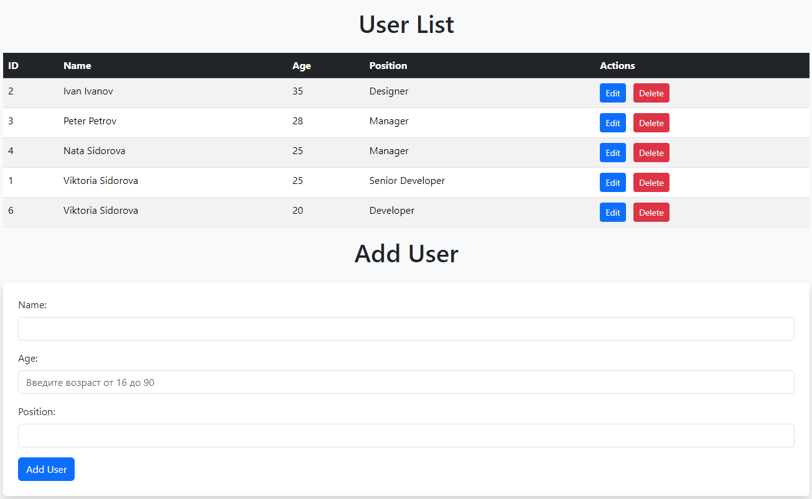

# users_update_app
Это приложение - тесовое задание от компании ВА Системс.

Задание - написать приложение на java spring, файл настроек, в БД PostgreSQL одна таблица пользователей, у пользователя имя, возраст, должность, сделать эндпоийнты для создания пользователя, получения пользователя по id,  удаления пользователя по id.
Добавлены эндпойнты для редакnирования пользователя по id, получения всех пользователей, удаления всех пользователей.
Добавлен вебинтерфейс на http://localhost:8080 и вебконтроллер.



#### Клонируйте репозиторий на локальный компьютер
```powershell
git clone https://github.com/Ollegro/users_update_app.git
```
### Для большей уверенности, включите vpn - некоторые зависимости иначе не даются )) 

#### Запустите    
```powershell
docker-compose up
```
#### Ждите скачивания зависимостей и сборки. Приложение развернется в контейнере и запустится

#### Проверьте что контейнеры запущены
```powershell
docker-compose ps
```
Настройте в IDEA соединение c БД. user - postgres , password - postgres , port - 5432 , db - mydatabase , host - localhost.

На момент запуска приложения таблица users в БД чистая.

Заполнить таблицу выполнить файл - init.sql (или не заполнять, а добавлять пользователей через POST запросы).

### Запросы:

Можно использовать PowerShell-команду Invoke-WebRequest или использовать Postman или Swagger.

Через PowerShell:

#### POST-запрос:
Для POST-запросов с телом JSON используйте параметр -Body, заполняем body:
```powershell
$body = @{name = "Viktoria Sidorova";age = 20;position = "Developer"} | ConvertTo-Json
```
--потом запрос:  
```powershell
Invoke-WebRequest -Uri http://localhost:8080/users -Method POST -Body $body -ContentType "application/json" 
```
#### GET-запрос получения 1 пользователя по id:  
Получение 1 пользователя  
```powershell
Invoke-WebRequest -Uri http://localhost:8080/users/1 -Method GET
```
Получение всех пользователей 
```powershell
Invoke-WebRequest -Uri http://localhost:8080/users -Method GET
```

#### PUT-запрос:
Изменение 1 пользователя по id

```powershell
$url = "http://localhost:8080/users/1"
$body = @{
    name = "Viktoria Sidorova"
    age = 25
    position = "Senior Developer"
} | ConvertTo-Json

try {
    $response = Invoke-WebRequest -Uri $url -Method Put -Body $body -ContentType "application/json"
    $response.Content | ConvertFrom-Json
} catch {
    "Ошибка: $($_.Exception.Message)"
}
```
#### DELETE-запрос:
Удаление 2 пользователя по id 
```powershell
Invoke-WebRequest -Uri http://localhost:8080/users/2 -Method DELETE 
```
#### DELETE-запрос:
Удаление всех пользователей   
```powershell
Invoke-WebRequest -Uri http://localhost:8080/users -Method DELETE
```
#### Добавлены Unit тесты для проверки создания пользователя, работы сервиса, контроллера, репозитория.
Добавлена тестовая база данных h2

